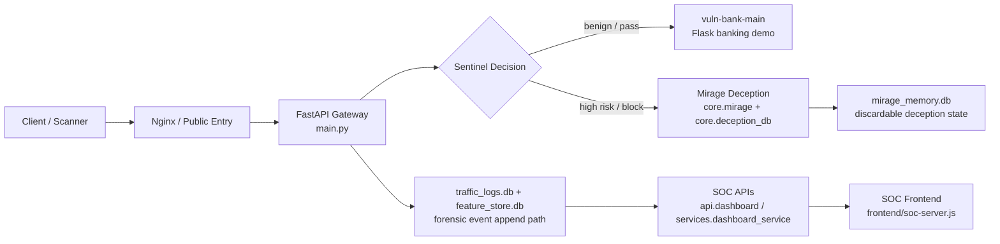

# Mirage-Sentinel

最後更新：2026-06-01

Mirage-Sentinel 是一個金融 API 主動防禦與欺敵系統原型。現階段的重點不是一般靜態 honeypot，而是把疑似攻擊流量在觸及真實上游前導入 Mirage 欺敵路徑，並把完整互動寫入鑑識事件庫，供 SOC 查詢、回放與成效分析。

目前專案狀態：可運行整合原型。

- 公開入口由 `main.py` 的 FastAPI Gateway 承接。
- 正常流量會代理到 `vuln-bank-main` 金融 Demo 上游。
- 高風險流量會進入 Mirage 欺敵回應與 `mirage_memory.db` 狀態記憶。
- SOC Dashboard API 已能查詢近期流量、分流結果、攻擊鏈回放與 Mirage 成效統計。
- OCI / Docker Compose 部署、PR smoke、post-deploy smoke 與 Semgrep 掃描已建立。

## Highlights

- **前置分流與欺敵回應**：Gateway 會在公開入口評估請求風險，將高風險互動導入 Mirage 欺敵路徑，降低攻擊流量觸及真實上游的機會。
- **資料庫解耦**：`traffic_logs.db` 作為鑑識事件庫，誘餌狀態由 `mirage_memory.db` 維持，避免把可拋棄式欺敵資料與真實業務資料混用。
- **毫秒級事件時間線**：請求、回應與 Mirage 狀態欄位保留毫秒精度，支援 SOC 回放與攻擊鏈分析。
- **非阻塞鑑識寫入**：Gateway 使用背景任務寫入事件，降低鑑識 I/O 對公開 API 回應時間造成可觀測側信道的風險。
- **SOC 可觀測性**：Dashboard API 提供近期事件、攻擊鏈、IP bundle、TTP 與 Mirage 成效統計，協助驗證流量是否成功進入欺敵路徑。
- **隔離部署基線**：sandbox 服務已採用 non-root、read-only、cgroup v2 resource limits、`privileged: false`、`cap_drop: [ALL]` 與 `no-new-privileges` 等最小權限設定。

## 目前架構



### 核心元件

| 元件 | 目前作用 |
| --- | --- |
| `main.py` | FastAPI API Gateway。處理 `/banking/{path}` 與 catch-all 代理、Sentinel 判斷、Mirage 分流、毫秒級事件欄位與背景寫入。 |
| `core/sentinel.py` | 簽名與行為風險檢測基礎。 |
| `model/Sentinel/XGBoost/` | 本機 AI Sentinel 模型與推論器。模型不可用時會降級為中立 PASS。 |
| `core/mirage.py` | 產生金融 API 欺敵資料，可接 Ollama / Hugging Face / fallback 模板。 |
| `core/deception_db.py` | `mirage_memory.db` 欺敵記憶，保存假登入、假交易、假卡片、假帳單與 fake session。 |
| `core/traffic_db.py` | `traffic_logs.db` 鑑識事件落地，另以 `feature_store.db` 保存衍生特徵。 |
| `api/dashboard.py` | 掛在 Gateway 內的 SOC Dashboard API router，路徑前綴為 `/api/v1/dashboard`。 |
| `services/dashboard_service.py` | 可獨立啟動的 SOC 後端，提供事件查詢、攻擊鏈回放、統計與 IP bundle。 |
| `frontend/` | Node/Express 前端。`soc-server.js` 是 SOC 入口，`customer-server.js` 是獨立客戶 demo 入口。 |
| `sandbox_service.py` | 隔離式 AI sandbox 服務基礎，目前 Compose 會啟動，嚴格接入主分流仍屬待收斂項。 |
| `vuln-bank-main/` | 外部銀行 Demo 上游，包含 Flask app、GraphQL、交易、虛擬卡與 AI chat 測試面。 |

## 安全邊界

Mirage-Sentinel 的 README 以目前實作為準，不把尚未完成的安全控制寫成已完成。

### 資料庫分工

- `data/traffic_logs.db`
  - 鑑識事件庫，設計上應只走 append-only 寫入路徑。
  - SOC / 後台分析模組可以讀取它。
  - 公開 honeypot / 欺敵決策不應依賴讀取此庫。

- `data/feature_store.db`
  - 衍生特徵資料庫，由 `core/traffic_db.py` attach 使用。
  - 用於 SOC 顯示 header entropy、時間特徵、Sentinel 分數、deception score 等欄位。

- `data/mirage_memory.db`
  - 欺敵狀態記憶庫，可拋棄、可讀寫。
  - 保存攻擊者 fake session、假帳戶、假交易、假卡片與帳單狀態。
  - 不可混入真實業務資料。

- PostgreSQL
  - 可選真實 demo data backend，透過 `DATABASE_URL` 啟用。
  - `vuln-bank-main` 在完整 Compose Demo 中使用自己的 PostgreSQL。

### 時間與側信道

- 事件欄位如 `request_at`、`response_at` 以毫秒格式寫入，例如 `YYYY-MM-DD HH:MM:SS.mmm`。
- Mirage 回應中的 `created_at` / `queued_at` 使用帶毫秒的 ISO 8601。
- Gateway 會透過 FastAPI `BackgroundTasks` 寫入鑑識事件，避免一般 API 回應被日誌 I/O 明顯拖慢。
- 待補強：仍需把所有同步 fallback 寫入路徑與讀取鑑識庫的風險特徵 helper 全面遷出公開決策路徑。

### 容器隔離

- `sandbox` 服務在 Compose 中已設定：
  - `user: "1000:1000"`
  - `read_only: true`
  - `privileged: false`
  - `cgroup: private`
  - `cpus: 0.20`
  - `mem_limit: 256m`
  - `memswap_limit: 256m`
  - `pids_limit: 64`
  - `/tmp` tmpfs: `size=32m,noexec,nosuid,nodev`
  - 專用 `sandbox_memory` volume 掛載到 `/app/data`，只承載可拋棄的 `mirage_memory.db`
  - `cap_drop: [ALL]`
  - `security_opt: no-new-privileges:true`

- cgroup v2 操作與驗證：
  - `ops/create_cgroups.sh` 會檢查 `/sys/fs/cgroup/cgroup.controllers`，確保宿主機使用 unified cgroup v2 hierarchy。
  - `tests/cgroup_smoke.sh` 會建立測試 cgroup，寫入 `memory.max`、`pids.max`、`cpu.max`，並驗證限制是否生效。
  - Docker Compose 的 `cpus` / `mem_limit` / `pids_limit` 會由 Docker runtime 映射到 cgroup v2 控制器；正式環境需確認宿主機與 Docker daemon 已啟用 cgroup v2。
  - `ops/kernel/sandbox_cgroup_audit.c` 是可選 Linux Kernel Module，會建立 `/proc/sandbox_cgroup_audit`，提供 kernel-space 的 sandbox cgroup policy audit 輸出。

- 待補強：主 backend Dockerfile 目前仍使用 `python:3.11-slim` 預設使用者，尚未完全對齊 sandbox 的非 root / read-only 基線。

## 專案結構

```text
Mirage-Sentinel/
├── main.py                         # FastAPI Gateway / public proxy / Mirage routing
├── sandbox_service.py              # isolated sandbox service foundation
├── core/
│   ├── sentinel.py                 # signature and behavioral detection
│   ├── mirage.py                   # deceptive response generation
│   ├── deception_db.py             # mirage_memory.db state
│   ├── traffic_db.py               # forensic event writes
│   ├── feature_store.py            # Redis-backed short-term graph features
│   └── analytics_engine.py         # SOC-only forensic analysis helpers
├── api/
│   ├── dashboard.py                # /api/v1/dashboard router
│   └── db/                         # optional SQLAlchemy banking demo models
├── services/
│   └── dashboard_service.py        # standalone SOC backend
├── frontend/
│   ├── soc-server.js               # SOC frontend/proxy
│   ├── customer-server.js          # separate customer demo frontend
│   └── public/
├── model/
│   ├── Sentinel/XGBoost/           # local Sentinel model artifacts and loader
│   ├── Sentinel/DistilBERT/        # experimental NLP detector
│   └── Mirage/Llama/               # Mirage model notes / adapter
├── deploy/nginx/
│   ├── local.conf
│   ├── oracle.conf
│   └── dual-demo.conf
├── scripts/
│   ├── ci/                         # smoke gates
│   ├── postgres/                   # PostgreSQL schema helpers
│   └── update_seclists.py
├── docs/
│   ├── REQUIREMENTS.md
│   ├── DEVELOPMENT_GUIDELINES.md
│   ├── RUNBOOK.md
│   ├── STATUS_REPORT.md
│   └── SECLISTS_UPDATE_GUIDE.md
└── vuln-bank-main/                 # Flask vulnerable banking demo upstream
```

## 快速啟動

### 1. Python 本機開發

```powershell
python -m venv .venv
.\.venv\Scripts\activate
pip install -r requirements.txt
uvicorn main:app --reload --host 0.0.0.0 --port 8000
```

常用入口：

- FastAPI health check: <http://127.0.0.1:8000/healthz>
- FastAPI docs: <http://127.0.0.1:8000/docs>
- OpenAPI schema: <http://127.0.0.1:8000/openapi.json>
- Banking proxy: <http://127.0.0.1:8000/banking/>

若要讓正常流量真的打到銀行上游，需另行啟動 `vuln-bank-main`，或設定：

```powershell
$env:VULN_BANK_BASE_URL="http://127.0.0.1:5000"
```

### 2. SOC 前端

若使用 `main.py` 內建的 Dashboard API，請在啟動 FastAPI 前設定：

```powershell
$env:ENABLE_DASHBOARD="true"
$env:API_KEY="dev-local-dashboard-key"
uvicorn main:app --reload --host 0.0.0.0 --port 8000
```

再啟動前端：

```powershell
npm --prefix frontend install
$env:BACKEND_API_BASE_URL="http://127.0.0.1:8000/api/v1/dashboard"
$env:API_KEY="dev-local-dashboard-key"
npm --prefix frontend run start:soc
```

SOC 前端預設在：

- <http://127.0.0.1:3000>

Dashboard API 需要：

- `ENABLE_DASHBOARD=true`
- 非 placeholder 的 `API_KEY`
- 請求 header `X-API-Key: <API_KEY>`

### 3. 本地 Compose Smoke

```powershell
$env:API_KEY="dev-local-dashboard-key"
.\scripts\ci\run-local-smoke.ps1
```

Linux / macOS:

```bash
export API_KEY="dev-local-dashboard-key"
bash scripts/ci/run-local-smoke.sh
```

目前根目錄 `docker-compose.yml` 主要啟動 Gateway、sandbox 與可選 PostgreSQL profile。完整的 `vuln-bank-main` 上游不在這個本地 Compose 檔內；若要完整銀行 demo，請使用 dual-demo Compose 或先獨立啟動 `vuln-bank-main`。

### 4. 完整 Demo Compose

OCI / 完整 demo 目前以 `docker-compose.oracle.dual-demo.yml` 為主要參考：

```bash
docker compose --profile demo-ui -f docker-compose.oracle.dual-demo.yml up -d --build
```

主要服務：

- `backend_public`: 公開 Gateway，預設 host port `127.0.0.1:8000`
- `backend_soc`: SOC backend，預設 host port `127.0.0.1:8002`
- `frontend_soc`: SOC frontend，預設 host port `3000`
- `frontend_customer`: 客戶 demo frontend，profile `demo-ui`，預設 host port `127.0.0.1:3001`
- `vuln_bank`: Flask banking upstream
- `vuln_bank_db`: vuln-bank PostgreSQL
- `postgres`: Mirage-Sentinel optional PostgreSQL
- `redis`: short-term feature store
- `sandbox`: isolated deception sandbox foundation
- `ollama`: optional local Mirage model runtime

## API 摘要

### Public Gateway

```bash
curl -i http://127.0.0.1:8000/healthz
curl -i http://127.0.0.1:8000/openapi.json
curl -i http://127.0.0.1:8000/banking/
```

Gateway 分流事件會記錄以下關鍵欄位：

- `route_before`
- `route_after`
- `deception_reason`
- `policy_hit`
- `upstream_attempted`
- `upstream_status_code`
- `deception_engaged`
- `deception_mode`
- `real_backend_touched`
- `response_origin`
- `flow_stage`
- `session_chain_id`
- `principal_id`

### Dashboard / SOC

```powershell
$env:API_KEY="your-dashboard-api-key"

curl -H "X-API-Key: $env:API_KEY" `
  "http://127.0.0.1:8000/api/v1/dashboard/recent_traffic?limit=10"

curl -H "X-API-Key: $env:API_KEY" `
  "http://127.0.0.1:8000/api/v1/dashboard/events/by_route/deception?limit=10"

curl -H "X-API-Key: $env:API_KEY" `
  "http://127.0.0.1:8000/api/v1/dashboard/events/by_risk_score?min_score=60&max_score=100&limit=20"

curl -H "X-API-Key: $env:API_KEY" `
  "http://127.0.0.1:8000/api/v1/dashboard/replay/session/<session_chain_id>"

curl -H "X-API-Key: $env:API_KEY" `
  "http://127.0.0.1:8000/api/v1/dashboard/statistics/deception_effectiveness?hours=24"
```

## 驗證與 CI

本機單元測試：

```powershell
python -m unittest discover -p "test_*.py"
```

本機 smoke：

```powershell
.\scripts\ci\run-local-smoke.ps1
```

GitHub Actions：

- `.github/workflows/pr-smoke.yml`
  - PR / push main 執行 Compose health 與 OpenAPI smoke。
- `.github/workflows/post-deploy-smoke.yml`
  - Deploy 後在 OCI host 上檢查 `8000`、`8002`、SOC frontend 與 customer frontend。
- `.github/workflows/deploy.yml`
  - SSH 到 OCI host，更新 repo，啟動 `docker-compose.oracle.dual-demo.yml`，並執行 Mirage / health / frontend gate。
- `.github/workflows/semgrep-scan.yml`
  - OWASP、SQLi、JWT、Secrets、Flask、Python 規則掃描。

## 目前完成度

### 已落地

- FastAPI Gateway 可作為 banking proxy。
- 高風險流量的前置 Mirage 分流路徑已在 `main.py` 中落地，事件可標示是否觸及上游。
- Mirage fake session 與狀態化假資料已保存於 `mirage_memory.db`。
- SOC 查詢 API 支援近期流量、IP bundle、路由分類、風險分數查詢、principal replay、session replay 與 deception effectiveness。
- 毫秒級事件時間欄位已在主要寫入路徑使用。
- Sandbox 容器在 Compose 層已有最小權限設定。
- CI smoke 與 Semgrep 掃描已存在。

### 待補強

- 主 backend 容器仍需非 root、read-only filesystem、cap drop 與最小 writable mount。
- `traffic_logs.db` 的公開路徑讀取 helper 仍需全面移往 `feature_store.db` / Redis，確保 honeypot 決策不依賴鑑識庫讀取。
- `sandbox_service.py` 已具備隔離式 AI Agent 端點，但主 Gateway 目前主要走 `core.mirage` / `mirage_memory.db`，嚴格 sandbox 接入仍需收斂。
- 本地 `docker-compose.yml` 與完整 `dual-demo` Compose 的服務拓撲不同，文件與 smoke 已盡量標示差異，後續可再合併成更清楚的 dev/prod profile。
- 部分舊欄位命名仍保留相容性，例如 `principal_id` 已作為互動主體識別，但歷史註解仍需逐步清理。

## 文件入口

- [需求規格](docs/REQUIREMENTS.md)
- [開發規範](docs/DEVELOPMENT_GUIDELINES.md)
- [目前狀態報告](docs/STATUS_REPORT.md)
- [運維與回放 Runbook](docs/RUNBOOK.md)
- [SecLists 維護指南](docs/SECLISTS_UPDATE_GUIDE.md)
- [資料庫設定](DATABASE_SETUP.md)
- [虛擬卡配置](VIRTUAL_CARD_CONFIG.md)
- [AI Agent 說明](AI_AGENT_README.md)

## License

本專案採用 [Apache License 2.0](LICENSE) 授權。
