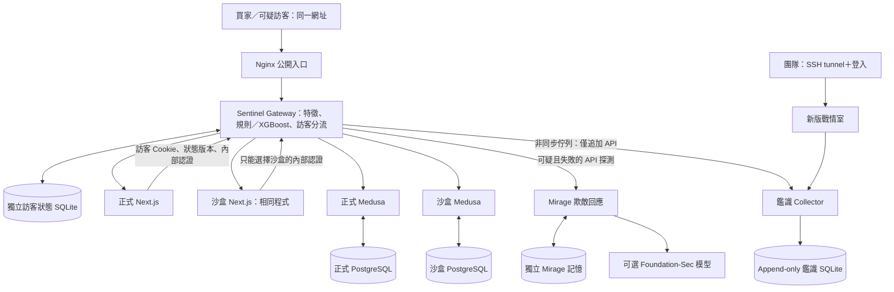

# Mirage-Sentinel 電商遷移與安全整合報告

日期：2026-09-19。範圍：本機專案修改、測試、OCI 部署準備。**本機 Docker 已恢復並完成 Linux 映像建置；OCI 上線狀態見文末追加紀錄。**

## 1. 結論與交付狀態

已加入基於 Medusa DTC starter 的獨立電商版本，包含正式／沙盒兩套 Medusa、相同 Next.js 前台、訪客分流 Gateway、Mirage 回應服務、獨立鑑識 Collector、新版戰情室，以及部署與驗收腳本。原有銀行程式與 OCI 部署檔保留，並未在遠端切換。

本機驗證：19 項 Python 測試通過，Next.js production build 通過，Medusa backend/admin build 與 Medusa lint 通過，Compose（包含可選 llm profile）設定解析通過。本次續作已恢復 Docker Desktop，完成 Linux x86_64 三個映像建置，並實測唯讀容器與資料庫初始化。ARM64 由 GitHub Actions 原生 runner 驗證；API、瀏覽器與部署結果以文末追加紀錄為準。

## 2. 兩個 starter 的差異與選擇

| 項目 | medusa-starter-default | dtc-starter |
| --- | --- | --- |
| 組成 | Medusa 後端起始專案 | Medusa 後端與 Next.js 商店前台的 monorepo |
| 完整購物介面 | 需要另外搭配前台 | 提供商品、購物車、結帳、會員、訂單流程 |
| 官方狀態 | README 已標示 deprecated，指向 DTC | 官方所指向的 DTC 起始專案 |
| 本次用途 | 不作為新整合起點 | 採用並保留 MIT 授權 |

官方來源：[舊 starter](https://github.com/medusajs/medusa-starter-default)、[DTC starter](https://github.com/medusajs/dtc-starter)。本次採用 commit `bd2441acc18359533758fbf4db5bc80129055d2e`；Medusa 2.21.0、Next.js 15.5.24、pnpm 10.11.1，依原始 lockfile 安裝。見 `commerce/UPSTREAM.md`。

這不是把 upstream URL 換掉就完成的工作：原銀行 API、HTML、登入、假帳戶／假交易與電商模型不同，必須重做入口整合和狀態隔離。

## 3. 已確認需求

1. 保護企業的購物網站與電商 API，同時蒐集攻擊手法。
2. 正常與沙盒訪客皆能操作完整購物網站；網址與前台程式相同。
3. 判定可疑後，後續請求持續走沙盒；不搬移正式環境的購物車與登入狀態。
4. 使用持久訪客 Cookie；最後活動起算 30 天，支援人工解除。
5. 沙盒記憶到期不刪除已蒐集的鑑識紀錄。
6. 戰情室呈現正常與可疑流量、操作順序、分數、分流依據及實際回應。
7. 使用合成資料、模擬付款，不接外部寄信服務。
8. 模型不可用時使用規則。訓練資料集由使用者後續準備。
9. 管理後台與戰情室僅供團隊使用。

## 4. 舊專案與 OCI 現況

使用者提供的主機資訊：ARM64、4 CPU、約 23 GiB 記憶體，當時可用約 20 GiB；根磁碟 45 GB，剩約 18 GB，無 swap。使用 `docker-compose`，既有專案名稱 `mirage-sentinel`，部署檔為 `/home/ubuntu/Mirage-Sentinel/docker-compose.oracle.dual-demo.yml`。

Nginx 實際 `/` 與 `/banking/` 均導向 `backend_public:8000/banking/`，因此正式網站入口確實先經過 Gateway。另一份本機 `oracle.conf` 直接代理 vuln-bank，不能誤用來覆蓋實際配置。

兩個既有 Ollama 容器皆安裝 Foundation-Sec-1.1-8B-Instruct Q4_K_M（約 4.9 GB）；其中一個將 11434 綁定所有主機介面，外網可達性仍取決於 OCI／主機防火牆。Gateway 環境設定指向 `http://ollama:11434` 與 Foundation-Sec；sandbox 未列出相同環境變數，若其程式與本機一致，可能採用錯誤的 Llama 預設模型。本次未停用或刪除任何既有容器與 volume。

本機原程式的主要問題：

- `main.py` 的主要欺敵路徑直接呼叫 Mirage 並讀寫欺敵記憶，不代表請求已進入獨立 sandbox service。
- 有局部假 Dashboard HTML，但靜態資源、登入、註冊有例外分流，不能保證整個工作階段留在沙盒。
- `mirage_session` 沒有持久 Cookie 期限，記憶讀取混用 IP 與主體 ID。
- 偵測程式查詢鑑識庫，並存在同步寫入分支，與 AGENTS.md 的資料解耦要求有落差。
- 部分舊 Compose／Nginx 有寫死憑證或共用資料目錄；舊模型載入使用 joblib/pickle。
- 回應可能包含 Mirage／模型來源等內部識別欄位，容易洩漏欺敵實作。

上述發現是本次架構與關鍵路徑檢查，不等於對所有舊碼與第三方依賴逐行完成漏洞稽核。新版本未引用舊銀行主程式，舊系統的問題不會因新增版本而自動消失；正式切換前仍應避免使用舊配置對外服務。

## 5. 新架構



### 分流與身分

- `visitor_id` 是隨機 ID 加 HMAC 簽章；伺服器驗證，避免客戶端自行指定別人的 ID。
- 分流狀態以持久資料庫保存；標記後登入、頁面、靜態資源與 API 都選擇沙盒。
- 每次活動延長 30 天，重啟 Gateway 仍能取回狀態。過期或人工解除會變更狀態版本（epoch），舊商店 Cookie 不再被轉換／傳入。
- 使用相同瀏覽器 Cookie 回訪可恢復狀態；清除 Cookie、換瀏覽器或 Cookie 被竊，不在可靠識別保證內。IP 不作為主身分。
- 正式／沙盒切換不轉移購物狀態；首次進沙盒可能需要重新登入／建立購物車，這符合本次確認的需求。
- 已送往正式後端的在途請求無法撤銷。後續伺服器端 API 使用狀態版本檢查；過期版本回覆 409、要求重新載入，不改送正式環境。

### 完整購物體驗

兩套 Medusa 使用不同 PostgreSQL、JWT／Cookie secret 與 publishable key。同一份合成 seed 分別建立商品、庫存、區域、運送方式與手動付款提供者。商品內容一致不代表兩個資料庫的隨機 ID 相同。會員、購物車及訂單由 Medusa 維持，不讓 LLM 任意改寫價格、ID 或交易結果。

Next.js SDK 改為 server-only；所有 SSR／server action 呼叫皆送 Gateway，附上訪客 Cookie、狀態版本和專用內部認證。移除共享區域快取，API 使用 `no-store`，頁面動態渲染。前台唯一直接匯入 SDK 的 client component 已改用 server action。Gateway 保留多筆 Set-Cookie，並依狀態版本重新命名商店 Cookie。

沙盒共用一套合成商品目錄與一個 sandbox Medusa 實例，**不是每個訪客一台 VM／一個資料庫**。訪客的商店資料由 Medusa 會員與購物車權限管理；專題仍應測試跨訪客存取行為。

### Mirage

正常購物以及沙盒內成功的購物 API 由 Medusa 處理。對已判定可疑且回傳錯誤的沙盒 API，Mirage 可產生相容的 JSON 錯誤訊息並快取；不執行攻擊指令，不把回應改成任意 HTML，不返回真實秘密。

模型未啟用、連線失敗或超過 2 秒生成期限時，返回程式產生的 JSON。`llm` 是可選 profile，部署預設不下載另一份 4.9 GB 模型。A1 CPU 的 8B 冷啟動可能常超過此期限，因此本次不能宣稱 Foundation-Sec 已在新部署穩定生成回應。後續可測量後改成背景生成策略；延長同步等待會增加延遲與可辨識差異。

## 6. 模型與特徵

新介面採 XGBoost 原生 JSON 模型，不載入舊 `tfidf.pkl`／`scaler.pkl`。特徵契約位於 `model/commerce/features.json`：

`path_length`、`query_length`、`body_length`、`header_count`、`header_bytes`、`body_entropy`、`special_ratio`、`request_count_60s`、`interval_ms`、`method_write`、`json_body`、`rule_hits`。

文字規則涵蓋 query、body 與一般 headers，包含多層 URL 解碼；包含 SQL 注入、XSS、目錄遍歷、命令字串、SSTI 的基本簽章。管理 API／管理員登入不向購物入口開放，路徑編碼與 dot-segment 另做拒絕。

目前沒有新訓練的正式模型檔，所以預設規則運作。模型缺失、不相容、錯誤、忙碌或逾時都可退回規則。模型分數與規則分數分開記錄，規則分数不是校準過的攻擊機率。原生模型介面測試使用臨時微型模型，只驗證讀取與推論流程，不是準確率測試。

資料集需使用同一特徵處理程序，另行切分訓練／驗證／測試資料，包含正常購物、SSR 與 API 流量。門檻 0.7 尚未校準；不應據此宣稱系統能可靠識別真人駭客。未命中模型／規則的攻擊仍可能進入正式服務。

## 7. 鑑識與戰情室

Gateway 不掛載鑑識庫，只有追加 API 的 token；沙盒容器沒有鑑識網路、volume 或讀取憑證。Collector 接受事件後寫入 SQLite，事件表禁止 UPDATE／DELETE，重送相同 event ID 不重複插入。SOC 查詢使用唯讀資料庫連線與獨立登入驗證。

事件包括毫秒 UTC ISO 8601 時間、訪客 ID、序號、請求 ID、SSR 父請求 ID、來源 IP、method/path/query、headers/body、特徵值、模型／規則分數、決策来源、正式／沙盒路由、HTTP 狀態、實際回應與耗時。SOC 以純文字顯示攻擊內容，提供訪客篩選、正常／沙盒篩選、JSON 匯出與人工解除。

重要限制：

- 目前是容量 4096 的記憶體佇列，非 durable broker。Collector 故障會重試，但 Gateway 崩潰、強制終止或佇列滿時可能遺失尚未送達事件；SOC 顯示本次程序的 queue／drop 計數。不能宣稱零遺失。
- request／response 文字最多保存各 32 KiB；密碼、授權與 Cookie 等部分欄位遮罩，並非完整原始封包。
- 入口拒絕的超大請求等情況不一定進入 Gateway 事件表。後續需另外納入入口存取紀錄。
- 長期留存需要磁碟監控與備份。沒有自動刪除鑑識紀錄；避免 18 GB 空間被持續消耗。
- 這版戰情室是獨立新服務，沒有把舊銀行鑑識資料匯入新表。舊紀錄保留在既有部署。

## 8. 安全與隔離

- 正式資料、沙盒資料、訪客狀態、Mirage 記憶、鑑識資料分開 volume。
- sandbox Medusa、sandbox frontend、Mirage 不加入正式 DB／鑑識網路；Gateway 不加入資料庫網路。
- 公開請求需要 Nginx 注入的入口憑證；SSR 使用各環境獨立 token。沙盒 SSR token 強制只走沙盒，不能透過 Gateway 當跳板存取正式服務。
- Python／Next.js／Medusa／Ollama 服務採非 root、唯讀 rootfs、cap_drop ALL、禁止提權與資源上限。PostgreSQL 以 postgres 使用者運行，資料目錄獨立可寫。
- 可選 `model-volume-init` 是一次性無網路初始化程式，以 root 加唯一 CHOWN capability 調整新模型 volume 所有權；不處理訪客流量。
- 管理後台 9100、SOC 3100 只綁定主機 loopback；公開 Nginx 不代理管理入口。
- 憑證由 `prepare_commerce.py` 隨機生成，`.env.commerce` 不放進原始碼包。沒有修改／覆寫舊部署的憑證。
- 日誌寫入不在購物回應同步路徑。這不代表所有正式／沙盒回應耗時都一致，也沒有做「無時間側信道」的量測證明。
- 公開發布前需要 HTTPS，否則持久 Cookie 與登入資料仍可能被竊聽。HTTP 預設只供 SSH tunnel 階段驗收。

## 9. OCI 部署步驟

### 9.1 上傳與並行驗收

把 `artifacts/mirage-commerce-source.zip` 上傳到 OCI 的新目錄，例如 `/home/ubuntu/mirage-commerce`，解壓後在該目錄執行。不要覆蓋舊 `/home/ubuntu/Mirage-Sentinel`。先確認磁碟空間可容纳 Node 安裝、兩個映像、build cache 與資料庫；不可只看最終映像大小。

```bash
python3 scripts/prepare_commerce.py --public-url http://localhost:8080
sudo python3 scripts/deploy_commerce.py --build --initialize
```

腳本會偵測 `docker compose` 或 `docker-compose`，依序建置避免同時壓滿 A1；建立獨立 `mirage-commerce` Compose project，對兩個新資料庫執行遷移與 tracked seed，取得兩套 publishable key，建立正式管理員，再啟動服务。首次需網路下載套件與映像。環境檔已存在時準備腳本會拒絕覆寫。

使用 PuTTY 的 SSH → Tunnels 設定 Local forwarding：

| 本機埠 | Destination | 用途 |
| --- | --- | --- |
| 8080 | localhost:8080 | 電商網站 |
| 3100 | localhost:3100 | 新戰情室 |
| 9100 | localhost:9100 | Medusa 管理後台 `/app` |

瀏覽器開啟 `http://localhost:8080`、`http://localhost:3100`、`http://localhost:9100/app`。SOC 帳密與管理員帳密從主機的 `.env.commerce` 私下取得，不貼入對話。舊 80／3000 服務仍保留。

### 9.2 執行真實 API 驗收

在新環境安裝驗收工具相依套件（可用 virtualenv）：

```bash
python3 -m venv .venv-smoke
.venv-smoke/bin/pip install httpx
.venv-smoke/bin/python scripts/smoke_commerce.py --url http://localhost:8080
```

此腳本會建立合成會員與訂單，測試正常註冊／登入、商品、購物車、地址、運送、手動付款、訂單，觸發分流後再走一次沙盒流程，並確認回訪可讀沙盒訂單、不能讀原正式訂單。**本機 Docker 已執行通過，並追加 Next.js JavaScript 資源可載入檢查。**

另需使用瀏覽器測試：正常購物至下單、觸發可疑請求、重新載入、沙盒登入／下單、關閉再開、人工解除。觀察 SOC 的父子請求與路由，確認所有 SSR API 皆留在正確環境。

### 9.3 可選模型

```bash
sudo docker-compose --env-file .env.commerce -f docker-compose.commerce.yml --profile llm up -d ollama
sudo docker-compose --env-file .env.commerce -f docker-compose.commerce.yml exec ollama ollama pull hf.co/fdtn-ai/Foundation-Sec-1.1-8B-Instruct-Q4_K_M-GGUF:latest
```

此方式使用新的模型 volume，不會刪除舊兩套模型。也因此可能再占用 4.9 GB；應先檢查空間，必要時另規劃既有模型的受控重用。本次沒有自動連接或停用舊 Ollama。正式發布應固定經 ARM64 驗證的映像 digest；Ollama profile 預設 image 是可覆寫的 `latest`，尚未固定 digest。

### 9.4 公開切換與回復

公開切換前完成 HTTPS、ARM64 容器驗收、容量與模型延遲量測。設定正確的 `PUBLIC_URL`／`PUBLIC_SCHEME` 並重新建置前台；本交付的 Nginx 只含 HTTP listener，TLS termination 配置仍需依實際網域與憑證完成，不能只修改 scheme 就宣稱啟用 HTTPS。

目前 `.env.commerce` 預設綁 `127.0.0.1:8080`，不會與舊服務搶 80。公開切換可由既有入口／TLS 代理改送新 edge；切換屬後續操作，本次未執行。要撤回新服務，可在新目錄執行：

```bash
sudo docker-compose --env-file .env.commerce -f docker-compose.commerce.yml down
```

不要加 `-v`，避免刪除新資料與鑑識紀錄。舊 `mirage-sentinel` project 不受此命令影響；若後續曾改公開入口，需將入口還原到舊服務。

## 10. 驗證結果與未完成項目

| 項目 | 結果 |
| --- | --- |
| 新分流／狀態／鑑識測試 | 19 passed；含 Cookie 簽章、30 天滑動期限、重啟、人工解除 |
| 逃逸與錯誤路徑 | 已測沙盒失效不回正式、SSR 過期版本、內部 token 隔離、編碼路徑遍歷、管理入口拒絕 |
| 規則／模型 | 已測 body/header 偵測、模型逾時備援、XGBoost JSON 載入與推論契約 |
| 鑑識 | 已測 append-only、重送去重、寫入 token 不能讀 SOC、佇列滿不阻塞 |
| 新部署設定 | Compose default 與 llm profile `config --quiet` 通過；网络隔離靜態測試通過 |
| 前台 | Next.js build 與型別檢查通過，購物頁面為動態渲染 |
| 後端 | Medusa build 與 lint 通過；管理前台編譯通過 |
| Linux standalone／ARM64 Docker build | 本機 x86_64 建置通過；ARM64 由部署前 CI 驗證 |
| Medusa DB migration／真實購物 API | 兩套資料庫 migration、註冊、登入、商品、購物車、模擬付款、下單及回訪隔離均通過 |
| 瀏覽器完整購物與長期回訪 | 已檢查商店、商品頁、尺寸選擇與加入購物車；完整 UI 結帳與實際 30 天等待未測，TTL 使用可控時間單元測試 |
| Foundation-Sec 實際生成品質／CPU 延遲 | 未量測 |
| 新電商模型准确率／誤判率 | 未訓練、未量測；目前使用規則 |
| OCI 部署與公開切換 | 未執行 |

測試不是把完整部署已成功的替代證據。這份報告區分了已實作、已測試與需在 Linux／OCI 驗收的範圍。

## 11. 主要檔案

- `commerce/`：官方 DTC 原始碼、鎖定相依、整合修改、兩個 Dockerfile。
- `services/commerce/gateway.py`：入口分流、SSR 防繞過、Cookie／回應代理。
- `services/commerce/state.py`：持久訪客與 30 天狀態。
- `services/commerce/detection.py`：特徵契約、規則與 XGBoost JSON。
- `services/commerce/mirage.py`：隔離的錯誤回應與欺敵記憶。
- `services/commerce/audit.py`、`collector.py`、`soc.html`：非同步送件、鑑識保存、戰情室。
- `docker-compose.commerce.yml`、`deploy/commerce/`：適用 OCI A1 的獨立部署設定。
- `scripts/prepare_commerce.py`、`deploy_commerce.py`、`smoke_commerce.py`：準備、初始化、驗收。
- `tests/test_commerce.py`、`artifacts/commerce-tests.xml`：測試與結果。
- `artifacts/mirage-commerce-source.zip`：不含憑證、資料庫、node_modules、模型權重或 build output 的上傳包。

本機資料夾原本不是 Git repository，因此沒有根專案 git diff／commit。原銀行檔案未被移除；可透過本報告列出的新檔與 `commerce/UPSTREAM.md` 檢視變更範圍。


## 12. 續作：本機 Docker、GitHub Actions 與 OCI 切換

- GitHub 專題：`IAN40070510/Mirage-Sentinel`。整合到真正專題 repository 的最新 main 歷史，不推送到 Medusa upstream。透過 Git Credential Manager 官方裝置授權，沒有索取帳號密碼或將 Token 寫入專案。
- Docker Desktop 的啟動問題來自失效的執行期 socket。只備份並重建 runtime 目錄，未重設 Docker、未刪除資料卷。
- Python 改用 `xgboost-cpu==3.2.0`，加入 `libgomp1`，支援 x86_64／ARM64 並避免 GPU 套件占用空間。參考 [XGBoost 安裝文件](https://xgboost.readthedocs.io/en/stable/install.html)。
- Medusa 容器保留非 root／唯讀／cap-drop；使用者設定目錄與必要暫存目錄使用 tmpfs。空 migration 目錄在建置階段預先建立。資料庫 URL 明確使用 `sslmode=disable`，僅用於此單機隔離 Docker 網路內的 PostgreSQL。
- SOC 與管理後台各有獨立 host bridge，仍只發佈 loopback port；沙盒未接入這些管理網路。
- 新增 `commerce-ci.yml`，使用 `ubuntu-24.04-arm` 執行單元測試、完整 Compose build、資料庫初始化與購物／隔離驗收。參考 [GitHub runner 文件](https://docs.github.com/en/actions/reference/runners/github-hosted-runners)。
- `deploy.yml` 必須等待 ARM64 測試通過，再使用既有 `OCI_HOST`、`OCI_USER`、`OCI_SSH_KEY`、`OCI_PORT` secrets。可用 repository variable `COMMERCE_PUBLIC_URL` 覆寫預設 `http://161.33.154.211`。
- 部署鎖定本次通過 CI 的 Git SHA，建立獨立 worktree release、以 SHA 標記映像；私密設定保存在 OCI 的 `~/Mirage-Sentinel/.env.commerce`。不使用 `git pull main` 取得可能尚未驗證的其他版本。
- 先啟動 `127.0.0.1:18080` 的 preview，通過兩套商店的註冊、購物車、模擬結帳、訂單與回訪隔離測試，才停止舊 `mirage_sentinel_nginx`，啟用新 edge 的 port 80。成功後停止舊銀行 SOC frontend，新 SOC 經 SSH tunnel 存取 3100，Medusa admin 經 tunnel 存取 9100。
- 初次切換失敗可自動恢復舊 nginx；後續版本失敗恢復前一版應用映像。**不自動逆轉資料庫 schema migration，升級前仍應備份資料庫；此流程也不是零停機部署。**
- 不執行全域 image/builder/volume prune。舊銀行資料與原 Ollama 保留；磁碟不足時部署停止。既有 standalone Ollama 的公開 port 11434 尚未由此流程更動。
- `post-deploy-smoke.yml` 改為唯讀電商頁面與 regions 檢查，取消重啟舊銀行。舊 `pr-smoke.yml` 保留手動觸發；Semgrep 原有流程保留。
- Actions YAML 已使用 actionlint 驗證通過；Python Ruff 檢查通過。

### 實際執行紀錄

- 本機：19 項 Python 測試通過；Linux Docker Python、Medusa、Next standalone 映像建置成功，兩套資料庫初始化成功。
- 實際購物 API：正常與沙盒的註冊、登入、商品、購物車、運送、模擬付款、訂單成功；正式訂單無法被沙盒訪客讀取；保存 Cookie 後重新建立連線可讀原沙盒訂單。
- 前台：實際瀏覽器可載入商品列表與商品頁，完成尺寸選擇、Server Action 加入購物車並確認金額，修復 Next 路由群組括號編碼造成的 JavaScript 404；CI smoke 現在逐一驗證首頁 script 資源。
- SOC：已驗證正常／沙盒事件入庫與控制 API；當次 54 筆事件送達、佇列為 0、丟棄為 0。這是短時測試，非高負載可靠度保證。
- 模型：目前沒有使用者的新電商 `xgb.json`，以 rules_only 運作；0.95／0.05 是規則分數，不是經校準的攻擊機率。LLM profile 未啟動，使用 Mirage 模板備援。
- GitHub／OCI：推送後以對應 workflow run 結果記錄，不能以本機成功代替 OCI 成功。
